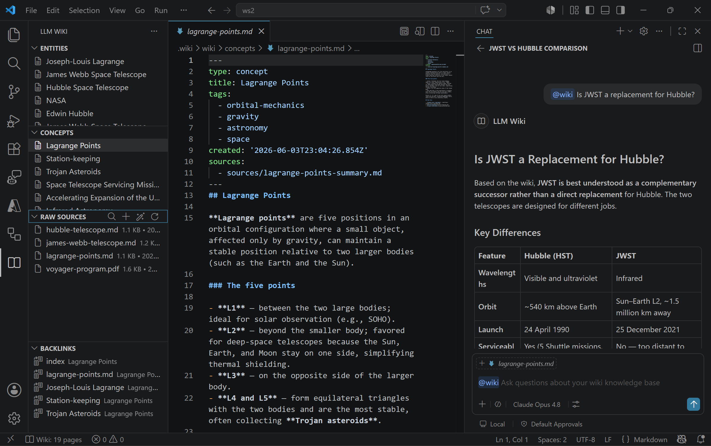

# LLM Wiki

> A personal knowledge base where the LLM does all the maintenance.

## What is this?

LLM Wiki is a VS Code extension for building personal knowledge bases that compound over time with zero bookkeeping burden. Instead of retrieving from raw documents at query time (like RAG), the LLM **incrementally builds and maintains a persistent wiki**: a structured, interlinked collection of markdown files that sits between you and your raw sources.

When you add a new source, the LLM reads it, extracts key information, and integrates it into the existing wiki — updating entity pages, revising topic summaries, noting contradictions, and strengthening the evolving synthesis. The knowledge is compiled once and kept current, not re-derived on every query.

You never write the wiki yourself. You curate sources, ask questions, and think. The LLM handles summarizing, cross-referencing, filing, and every other piece of maintenance that makes a knowledge base actually useful over time.

## Example interface



The LLM Wiki sidebar surfaces **Entities**, **Concepts**, **Raw Sources**, and **Backlinks** tree views. The generated wiki pages open in the editor, and the `@wiki` chat participant answers questions that synthesize across multiple sources.

## Architecture

The system has three layers:

| Layer | Owner | Purpose |
|-------|-------|---------|
| **Raw Sources** | Human | Immutable source documents — articles, papers, notes. The LLM reads but never modifies these. |
| **Wiki** | LLM | Generated markdown files — summaries, entity pages, concept pages, cross-references. The LLM owns this layer entirely. |
| **Schema** | Human + LLM | Conventions document (`AGENTS.md`) defining wiki structure, workflows, and rules. Co-evolved over time. |

See [ARCHITECTURE.md](./ARCHITECTURE.md) for full technical design and data-flow diagrams.

## Packages

The project is an npm workspaces monorepo with two packages:

| Package | npm name | Description |
|---------|----------|-------------|
| [packages/core](packages/core) | `@llmwiki/core` | Core wiki operations + MCP server — page I/O, index parsing, log management, lint checks, MCP tool server, ingest pipeline, bulk ingest, search, status. |
| [packages/vscode](packages/vscode) | `llmwiki` | VS Code extension — tree views, command palette, status bar, `@wiki` chat participant, bulk ingest of files and folders. |

```
llmwiki (VS Code extension) ──depends-on──▶ @llmwiki/core
```

## Prerequisites

- [Node.js](https://nodejs.org/) v20 or later
- [VS Code](https://code.visualstudio.com/) 1.101 or later
- A GitHub Copilot subscription (the extension uses VS Code's Language Model API for ingestion enrichment)

## Installation

```bash
# Clone the repository
git clone <repo-url>
cd llmwiki

# Install all workspace dependencies
npm ci

# Build all packages (core → vscode)
npm run build

# Package the extension into a .vsix
npm run package --workspace=packages/vscode
```

After packaging, install the generated `packages/vscode/llmwiki-0.1.2.vsix` via **Extensions: Install from VSIX…** in the VS Code Command Palette.

## VS Code Extension

Open the **LLM Wiki** icon in the Activity Bar to access:

- **Entities** — Browse entity pages (people, products, places, organizations).
- **Concepts** — Browse concept pages (ideas, techniques, patterns).
- **Raw Sources** — See every file in `raw/` with size & date; right-click to remove.
- **Backlinks** — See pages that link to the page you currently have open.

### Commands

| Command | Title | Description |
|---------|-------|-------------|
| `llmwiki.init` | LLM Wiki: Initialize Wiki | Scaffold the `.wiki/` directory structure (raw, wiki, index, log, `AGENTS.md`). |
| `llmwiki.ingest` | LLM Wiki: Ingest Files or Folder | Bulk-ingest one or many files, or every supported file inside a folder (walked recursively). |
| `llmwiki.query` | LLM Wiki: Query Wiki | Weighted full-text search across index titles, summaries, and page bodies. |
| `llmwiki.status` | LLM Wiki: Show Status | Show page count, source count, coverage %, last ingest date. |
| `llmwiki.openPage` | LLM Wiki: Open Page | Quick-open any wiki page by title. |
| `llmwiki.search` | LLM Wiki: Search Wiki | Filter entities/concepts by title, summary, or tag. |
| `llmwiki.searchRaw` | LLM Wiki: Search Sources | Find a raw source file by name. |
| `llmwiki.refresh` | LLM Wiki: Refresh | Run lint-fix, prune orphaned pages, and refresh all views. |
| `llmwiki.fix` | LLM Wiki: Fix Issues | Open the `@wiki /fix` chat to interactively resolve lint findings. |
| `llmwiki.removeSource` | LLM Wiki: Remove Source | Delete a raw source plus the wiki pages derived from it. |
| `llmwiki.scanRaw` | LLM Wiki: Scan Sources for New Files | Scan `raw/` for files that have no wiki page yet and offer to ingest them. |
| `llmwiki.selectModel` | LLM Wiki: Select Model | Choose which installed GitHub Copilot model family powers ingestion enrichment and `@wiki`. |

### Bulk Ingest

The **LLM Wiki: Ingest Files or Folder** command supports four invocation modes:

1. **Command Palette** — first choose **Files** or **Folder** mode, then select one or more items in the native picker. (The modes are split because a single OS dialog can't reliably select both files and folders at once.)
2. **Explorer context menu** — right-click any file or folder anywhere in the Explorer and choose **LLM Wiki: Ingest Files or Folder**. Multi-selections (Ctrl/Shift-click) are honoured.
3. **Raw Sources toolbar** — click the **+** (Ingest Files or Folder) button in the Raw Sources view title bar.
4. **Drag-and-drop into `raw/`** — files dropped into the Raw Sources view are auto-ingested by the file watcher.

When a folder is selected the extension walks it recursively, skipping `.`-prefixed entries and common build directories (`node_modules`, `dist`, `out`, `build`, `.wiki`). External files are copied into `<workspace>/.wiki/raw/` first, then sent through the per-file ingestion pipeline. Selecting more than 20 files triggers a confirmation prompt so you don't kick off a huge batch by accident.

### `@wiki` Chat Participant

Open the Chat view and type `@wiki` to converse with the wiki via GitHub Copilot:

- `@wiki /status` — show wiki statistics.
- `@wiki /save` — save the previous answer as a wiki page.
- `@wiki /lint` — run health checks and get fix suggestions.
- `@wiki /fix` — auto-fix lint issues using the LLM.

### Settings

| Setting | Default | Description |
|---------|---------|-------------|
| `llmwiki.modelFamily` | `claude-opus-4.6` | Preferred GitHub Copilot model family for ingestion enrichment and the `@wiki` chat participant. Falls back to any available Copilot model when the requested family isn't installed; leave blank to always use the first available model. Run **LLM Wiki: Select Model** to pick one interactively. |

## MCP Server

The `@llmwiki/core` package also exposes a Model Context Protocol server so external agents (Claude Desktop, Cursor, VS Code Copilot via MCP, etc.) can read, write, and maintain wiki content programmatically.

### Connecting from VS Code (automatic)

If you have the LLM Wiki VS Code extension installed, the MCP server registers itself automatically through VS Code's `mcpServerDefinitionProviders` contribution. No JSON to edit — just initialize a wiki (`LLM Wiki: Initialize Wiki`) and the `LLM Wiki` server will appear in the Copilot MCP server list. The launcher is started on demand using the editor's bundled Node.

### Connecting from Claude Desktop / Cursor / other MCP clients

The shared package ships an `llmwiki-mcp` stdio launcher. Add it to your client's MCP configuration:

```jsonc
// Claude Desktop: claude_desktop_config.json
// Cursor:        ~/.cursor/mcp.json
{
  "mcpServers": {
    "llmwiki": {
      "command": "npx",
      "args": ["-y", "-p", "@llmwiki/core", "llmwiki-mcp", "/absolute/path/to/your-project/.wiki"]
    }
  }
}
```

If you've installed `@llmwiki/core` globally (`npm i -g @llmwiki/core`), you can use `llmwiki-mcp` directly as the command instead of going through `npx`. The wiki-root argument is optional; when omitted the launcher defaults to `<cwd>/.wiki`.

### Manual JSON config in VS Code

If you'd rather pin the server in a workspace, add a `.vscode/mcp.json`:

```jsonc
{
  "servers": {
    "llmwiki": {
      "command": "npx",
      "args": ["-y", "-p", "@llmwiki/core", "llmwiki-mcp", "${workspaceFolder}/.wiki"]
    }
  }
}
```

### Available Tools

**Read tools:**

| Tool | Description |
|------|-------------|
| `wiki_status` | Wiki statistics — source count, page count, coverage, lint dates |
| `wiki_query` | Free-text search with weighted relevance scoring |
| `wiki_lint` | Health checks grouped by severity, with category filter |
| `wiki_list_pages` | All wiki pages with frontmatter metadata |
| `wiki_list_sources` | All raw source files with size and date |
| `wiki_read_page` | Read a single page by path (frontmatter + body) |
| `wiki_read_index` | All index entries with title, summary, category, tags |

**Write tools:**

| Tool | Description |
|------|-------------|
| `wiki_write_page` | Create or overwrite a page (auto-updates index) |
| `wiki_create_entity` | Create entity page at `entities/{slug}.md` |
| `wiki_create_concept` | Create concept page at `concepts/{slug}.md` |
| `wiki_update_page` | Merge partial updates into an existing page |
| `wiki_add_crosslinks` | Add "See also" links (validates targets exist) |
| `wiki_update_index` | Update index entry metadata |
| `wiki_ingest_with_context` | Ingest source with context-rich response |

**Prompts & resources:** Beyond tools, the server also registers MCP **prompts** (`ingest-and-integrate`, `lint-and-fix`, `research-topic`) and **resources** — `resource://wiki/index`, `resource://wiki/pages`, `resource://wiki/sources`, plus the `resource://wiki/pages/{path}` and `resource://wiki/sources/{path}` templates — so agents can browse wiki content without invoking tools.

See [docs/mcp-tools.md](docs/mcp-tools.md) for the full tool reference with schemas and workflows.

## GitHub Actions

[.github/workflows/ci.yml](.github/workflows/ci.yml) runs on push and PR to `main`. It installs dependencies, builds `@llmwiki/core` and the VS Code extension, type-checks both packages, runs the full test suite with coverage, and writes a coverage summary to the run.

## Development

```bash
npm ci            # Install all workspace dependencies
npm run build     # Build all packages (core → vscode)
npm test          # Run tests (vitest)
npm run lint      # Type-check all packages (tsc --noEmit)
npm run dev       # Watch mode (vitest watch)
npm run coverage  # Run tests with coverage reporting (@vitest/coverage-v8)
```

**Per-package commands:**

```bash
npm run build --workspace=packages/core    # Build core library
npm run build --workspace=packages/vscode    # Build VS Code extension
npm run watch --workspace=packages/vscode    # Rebuild extension on change
npm run package --workspace=packages/vscode  # Produce a .vsix
```

## License

[MIT](LICENSE) — Copyright (c) Microsoft Corporation.
